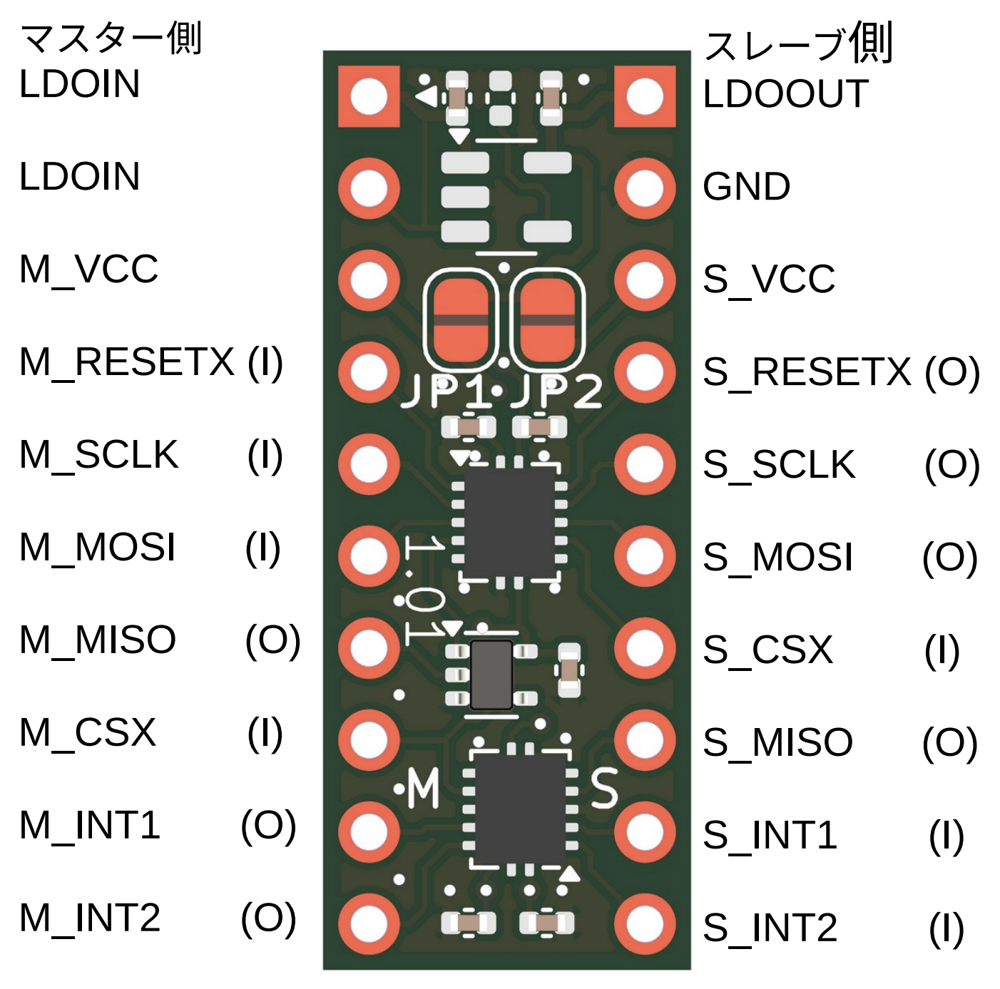

# CONVSPI
SPI 信号電圧変換基板 
SCLK, MOSI, MISO, CSX, RESETX, INT1/2 の ラインの信号電圧を変換 
マスター側の 1.2V から 5V までの信号電圧をスレーブ側の 1.2V から 5V までの信号電圧に変換 
CSX はインアクティブ時はマスター側の MISO をハイインピーダンス 

## Documents
+ [Brochure JP](docs/ConvSpi-1.00.docJp.pdf)
+ [Schematics](sch/ConvSpi-1.01.sch.pdf)

## Configuration files

## Examples (code, setup, etc)
